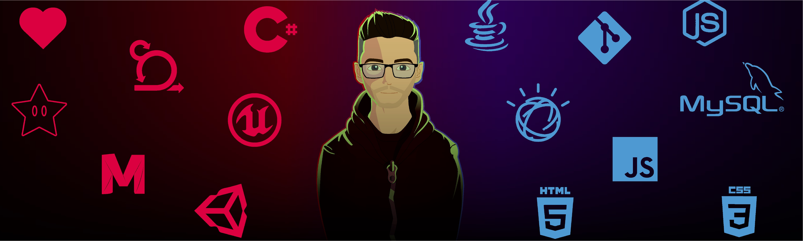

  

    
    
    
    
    
    

&nbsp;&nbsp;&nbsp;

<h3 align="center"> Hello! I'm Michael Douglas 👋 </h3>
<h3 align="center"> Full Stack Developer | Game Developer </h3>

&nbsp;&nbsp;&nbsp;

#### 
 I specialize in developing chatbots, focusing on planning conversational flows, APIs, and monitoring services.  In my free time, I'm passionate about game development and love creating immersive experiences. 🎮

#### 
 Feel free to check out my projects and connect with me!

&nbsp;&nbsp;&nbsp;
## **📊 Statistics:**  
&nbsp;&nbsp;&nbsp;

## **👨🏽‍💻 Skills:**

  
<strong>Languagens</strong>

    
    
    
    
    
    

  
<strong>Frameworks & Library</strong>

    
    
    
    

  
<strong>Database</strong>

    
    
    
    
  

  
<strong>Artificial Intelligence & Conversational Platforms</strong>

    
    
    

  
<strong>Cloud</strong>

    

  
<strong>Versioning</strong>

    
    
    

  
<strong>Workflow Platforms</strong>

    
    

